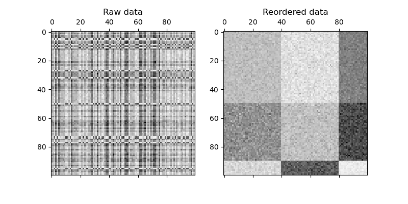

# DisNPLBM: Distributed Non-Parametric Latent Block Model
This repository contains our implementation of DisNPLBM proposed in the paper "Distributed MCMC inference for Bayesian Non-Parametric Latent Block Model" (accepted to The Pacific-Asia Conference on Knowledge Discovery and Data Mining (PAKDD 2024)).

## Requirements

* Scala (2.12.15)
* [Java jdk-8u202](https://www.oracle.com/java/technologies/javase/javase8-archive-downloads.html)
* [Terraform 0.13.5](https://releases.hashicorp.com/terraform/0.13.5/)
  

## Local run
### Build the program

The script build.sh is provided to build an executable jar containing all the dependencies. 
Use the following command to build it: 

```
/bin/bash build.sh
```

### Run the program

To run the built jar, use the following code:

```
scala -J-Xmx1024m ./target/DisNPLBM-1.0-jar-with-dependencies.jar local[*] <dataset name> <path to data> <number of partitions> <number of cores/task> <number of iterations> <dimension of observation space> <concentration parameter alpha> <concentration parameter beta>
```

Example of execution:

```
scala -J-Xmx1024m ./target/DisNPLBM-1.0-jar-with-dependencies.jar local[*] synthetic_100_100_9 $DATAPATH 4 1 100 1 5.0 2.0
```
The above code will perform  100 iterations on synthetic_100_100_9 dataset (provided in data file) on local mode with 4 partitions.


## Multi-node run (on grid5000 cluster)

For the multi-node run, we have used the Kubernetes cluster with standalone mode.  To deploy the Kubernetes cluster in Grid5000, we use [Terraform](https://github.com/pmorillon/terraform-provider-grid5000) with [helm](https://github.com/bitnami/charts/tree/main/bitnami/spark).
When executing in gri5000 use the following command to clone the code:
```
git clone --recursive https://github.com/redakhoufache/Distributed-NPLBM.git
```
Then, modify `terraform-provider-grid5000/examples/kubernetes/main.tf` to choose the number of nodes, site name, and other input parameters.
Example in Grenoble site using `dahu` clusters:

```
module "k8s_cluster" {
    source = "pmorillon/k8s-cluster/grid5000"
    version = "~> 0.0.1"
    nodes_count="6"
    site = "grenoble"
    nodes_selector = "{cluster = 'dahu'}"
    walltime = "4"
}
```

Finally, modify `multi_nodes_g5k_run.sh` to set your configuration and execute it. 

## Outputs and visualization
The program will output the runtime (in seconds), ARI, NMI, and the number of inferred block clusters:
```
Runtime: 12.646606094
ARI: 1.0
NMI: 1.0
Number of blocks: 9
```
These results and the inferred partitions are saved in a JSON file (in results data). A Jupyter notebook is provided to analyze all the results.


